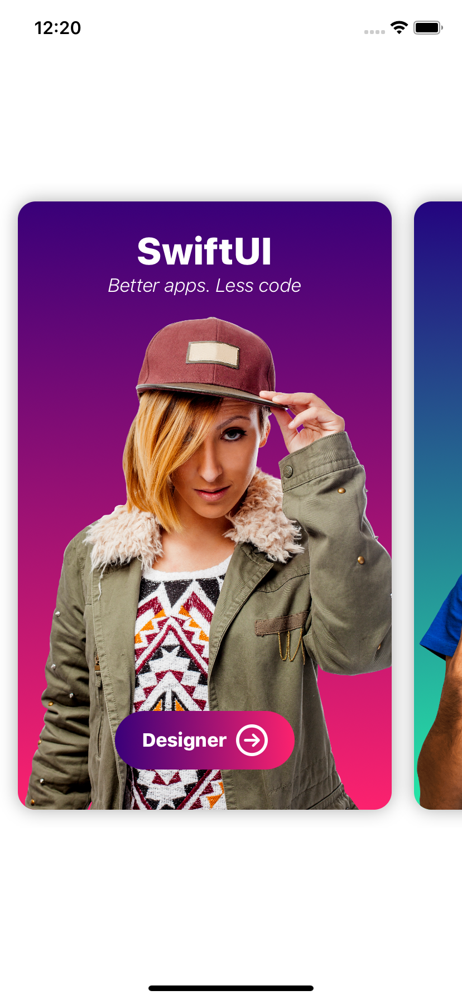
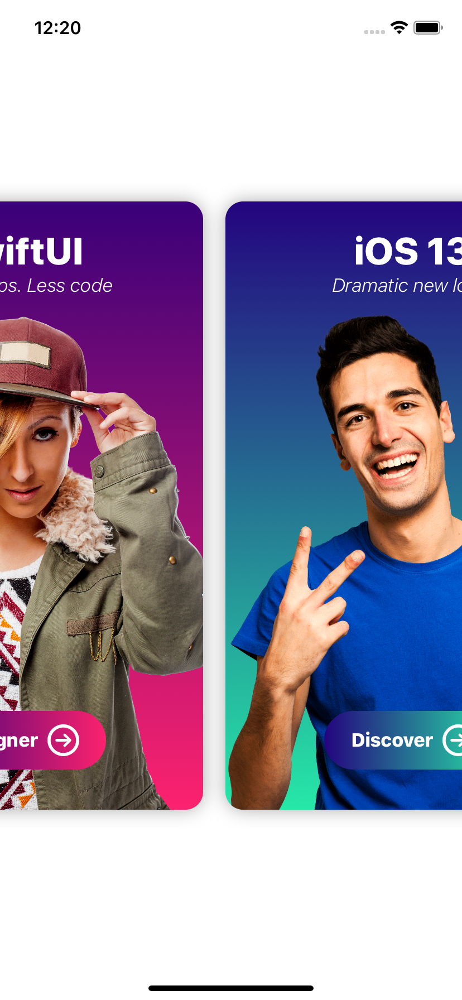

# Cards

A little iOS application where you can add cards from devlopers or designers.

# What I Learned

* Working with Scrollviews (in different directions)
* Working with Audiofiles
* Working with Slide animations by launching the app

# Images

  
